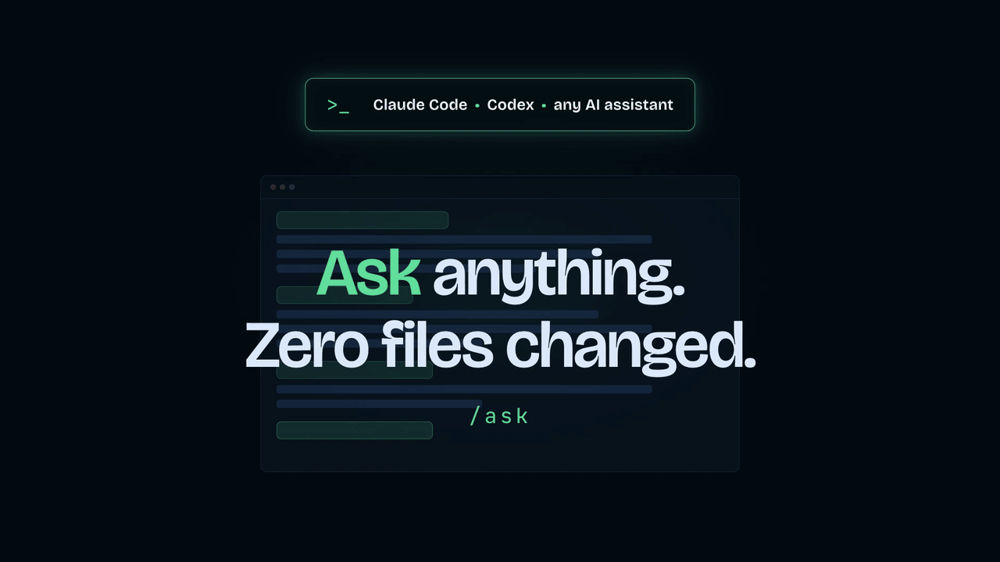

<p align="center">
  
</p>

# Ask Mode

> **Talk to your codebase without changing it.**

A portable read-only mode for Claude Code, Codex, and other AI coding assistants.

Inspect files, understand code, discuss architecture, compare approaches, and challenge decisions — without edits or implementation.

## Why?

Coding assistants often move from analysis to implementation. Ask Mode is for questions where the expected result is an explanation or a decision, with no changes to the project.

Use it to understand unfamiliar code, compare approaches, question a technical decision, or check what could break before making a change.

## How to use

Invoke Ask Mode with one question:

```txt
/ask why does this component rerender so often?
$ask is this i18n architecture unnecessarily complex?
```

| Where | Trigger |
| --- | --- |
| Claude Code | `/ask <question>` |
| Codex | `$ask <question>` |
| Other coding assistants | the form created at install time |
| Regular AI chat | paste the chat version once |

Each invocation covers one read-only request. Invoke Ask Mode again for the next question.

## What Ask Mode does

It can read and search files, inspect the repository, analyze code, compare options, and describe hypothetical changes.

It cannot edit files, install dependencies, run write-producing commands, change git, or modify the configuration or environment. Suggested changes remain explanations only.

## Ask vs Plan

Ask is for understanding the code and deciding whether a change is needed. Plan is for working out how to implement a change.

| | Ask | Plan |
| --- | --- | --- |
| Inspect code | Yes | Yes |
| Discuss alternatives | Yes | Yes |
| Main outcome | Understanding or a decision | An implementation approach |
| Modify files | Never | Not during planning |

## Portability

Ask Mode uses each assistant's own extension mechanism. It does not replace native modes or make the project independent from them; it only keeps the same read-only intent across tools.

## Limitations

Technical enforcement depends on the host tool.

- Claude Code runs `/ask` in its built-in Explore subagent, which provides read-only tools. Because that subagent has isolated context, include the necessary context in your question.
- Codex skills cannot declare a sandbox in `SKILL.md` or `agents/openai.yaml`. For an enforced local boundary, start Codex with `--sandbox read-only`; reject any request to leave that sandbox.
- Ask Mode can only inspect context the host tool is allowed to access.
- Commands that might write files or caches are avoided.

## Install in Claude Code

Claude Code now recommends skills for custom commands, so Ask Mode ships as [`.claude/skills/ask`](.claude/skills/ask).

### Method 1: assisted installation (recommended)

Paste [install-ask-for-claude-code.md](prompts-for-installation/install-ask-for-claude-code.md) into Claude Code and choose the global install to make `/ask` available in every project.

### Method 2: manual installation

Clone this repository, enter it, and link the skill globally:

```sh
mkdir -p "$HOME/.claude/skills"
ln -s "$PWD/.claude/skills/ask" "$HOME/.claude/skills/ask"
```

For a project-only install, copy `.claude/skills/ask` into the project's `.claude/skills/` folder. See the [Claude Code skills documentation](https://code.claude.com/docs/en/skills).

## Install in Codex

The Codex skill is in [`.agents/skills/ask`](.agents/skills/ask).

### Method 1: assisted installation (recommended)

Paste [install-ask-for-codex.md](prompts-for-installation/install-ask-for-codex.md) into Codex and choose the global install to make `$ask` available in every project.

### Method 2: manual installation

Clone this repository, enter it, and link the skill globally:

```sh
mkdir -p "$HOME/.agents/skills"
ln -s "$PWD/.agents/skills/ask" "$HOME/.agents/skills/ask"
```

For a project-only install, copy `.agents/skills/ask` into the project's `.agents/skills/` folder.

For a stronger read-only boundary, launch Codex with:

```sh
codex --sandbox read-only --ask-for-approval untrusted
```

Codex uses `$ask`, not a custom root slash command. See the [Codex skills](https://learn.chatgpt.com/docs/build-skills) and [sandbox](https://learn.chatgpt.com/docs/sandboxing) documentation.

## Other AI coding assistants

Paste [install-ask-for-any-ai.md](prompts-for-installation/install-ask-for-any-ai.md) into the target assistant. It selects the current native mechanism and states whether read-only behavior is technically enforced or instruction-based.

## Regular AI chat

Paste [ask-ai-chat-version.md](prompts-for-ai-chat/ask-ai-chat-version.md) into a conversation. Ask Mode stays active until you send exactly `exit ask mode`.

## Repository structure

```txt
ask-mode/
├── README.md
├── LICENSE
├── .gitignore
├── .agents/
│   └── skills/
│       └── ask/
│           ├── SKILL.md
│           └── agents/
│               └── openai.yaml
├── .claude/
│   └── skills/
│       └── ask/
│           └── SKILL.md
├── prompts-for-installation/
│   ├── install-ask-for-claude-code.md
│   ├── install-ask-for-codex.md
│   └── install-ask-for-any-ai.md
├── prompts-for-ai-chat/
│   └── ask-ai-chat-version.md
└── public/
    └── demo-script.md
```

## More workflow commands

- [WaitGo](https://github.com/arthurglaizal/wait-go) — Wait for all instructions before acting.
- [Session Recap](https://github.com/arthurglaizal/session-recap) — See what happened and where the work stands.

## Support

If you find my work useful, you can [buy me a coffee](https://ko-fi.com/arturo_ux) ☕️

## License

MIT — see [LICENSE](LICENSE).
